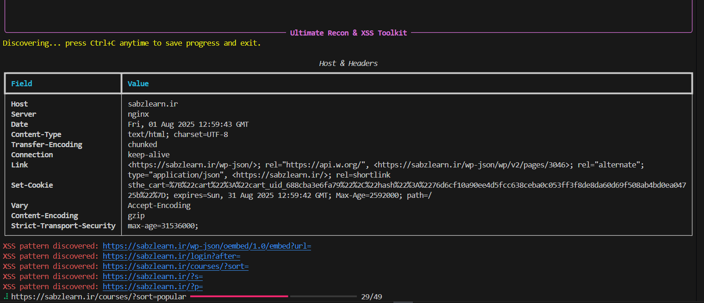
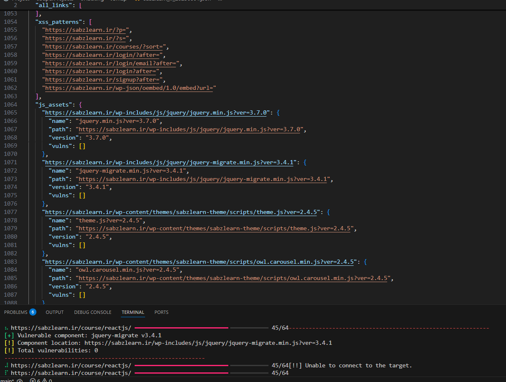

# 

# JSmap - The Ultimate Recon & XSS Toolkit

Welcome to **JSmap**, the black‑hat hacker’s dream CLI scanner. Designed to be lightning‑fast, deeply intelligent, and outrageously configurable, JSmap will make you feel like a wizard on your first pentest.

> “This tool is so wicked, it feels like... black magic.”

---

## 🛠 Some test



> “Try it XD”

---

## 🚀 What Is JSmap?

JSmap is a next‑generation reconnaissance and vulnerability‑discovery toolkit that:

1. **Crawls** entire web domains in parallel.
2. **Extracts** XSS‑prone URL patterns (summarized!).
3. **Detects** every JavaScript library/framework, version, and path.
4. **Scans** found JS files with **retirejs** for known CVEs.
5. **Automates** post‑scan XSStrike attacks for deep XSS analysis.

You don’t need to be a seasoned hacker—JSmap guides you from zero to hero.

---

## 🔥 Features at a Glance

* **High‑Speed Crawl**: Fully concurrent with customizable thread pool.
* **Live Progress Bar**: See exactly what page you’re on and how many remain.
* **Summarized XSS Patterns**: Instead of hundreds of `?p=78, ?p=80…`, JSmap reports only `?p=`—max efficiency.
* **JS Asset Discovery**: Finds every `<script src=...>` on your domain, pulls name + path + accurate version.
* **RetireJS Integration**: Automatically scans each JS file for vulnerabilities, neatly listed.
* **Seamless XSStrike Workflow**: One command to run `JSmapXssScanner_xsstrike.py` for crawling, blind injection, and fuzzing.
* **Graceful Ctrl+C Exit**: Stop anytime—data is saved, XSStrike is triggered, and you pick up right where you left off.
* **Fully Configurable**: Threads, timeouts, user‑agents, output paths—all optional flags.

---

## 🛠 Installation

```bash
# Clone repository
git clone https://github.com/mr-r0ot/JSmap-Scanner.git
cd JSmap-Scanner

# Create a Python venv (recommended)
python3 -m venv venv
source venv/bin/activate

# Install dependencies
pip install -r requirements.txt
```

---

## 🎮 Usage

Basic scan (all defaults, random UA, 20 threads):

```bash
python JSmap.py -u https://target.com
```

### Command‑Line Options

```text
-u, --url         Target URL (e.g. https://example.com)   [required]
-t, --threads     Number of concurrent threads (default: 20)
-o, --output      Custom output filename (default: <domain>_YYYYMMDD.json)
--timeout         HTTP request timeout (seconds, default: 10)
--user-agent      Specify a custom User‑Agent string
--random-agent    Use a random User‑Agent from built‑in list
```

> All requests ignore SSL certificate errors (Insecure mode ON).

---

## 🧐 How It Works

1. **Initialization**: JSmap prints a banner + reminder that `Ctrl+C` stops the scan and saves data.
2. **Header Grab**: Fetches base URL, displays `Host` + all HTTP headers in a Rich table.
3. **Concurrent Crawl**: BFS traversal with a live spinner + progress bar.
4. **XSS Pattern Extraction**:

   * Scans every `href`/`src` + inline JS for `?param=` patterns.
   * Filters out static `.js`/`.css` files.
   * Summarizes to `scheme://host/path?param=` only once per parameter.
5. **JS Asset Detection**:

   * Finds `<script src="">` tags, resolves URLs.
   * Extracts `name` and `version` (from `?ver=` or filename regex).
   * Runs **retirejs** scan for each asset (if installed), collects vulnerabilities.
6. **Data Export**: On finish (or `Ctrl+C`), writes JSON:

   ```json
   {
     "all_links": [...],
     "xss_patterns": [...],
     "js_assets": {
       "https://.../jquery.min.js?ver=3.7.0": {
         "name": "jquery.min.js?ver=3.7.0",
         "path": "https://.../jquery.min.js?ver=3.7.0",
         "version": "3.7.0",
         "vulns": [ ... ]
       },
       ...
     }
   }
   ```
7. **Automated XSStrike**: Immediately invokes:

   ```bash
   python JSmapXssScanner_xsstrike.py --update
   python JSmapXssScanner_xsstrike.py -u https://<domain> --crawl --blind
   python JSmapXssScanner_xsstrike.py -u <each XSS pattern>
   ```

   Finally, prompts to run fuzzing on each pattern.

---

## 🎁 After the Scan

* **Your JSON Report**: `<domain>_YYYYMMDD.json` with all discovered data.
* **Instant XSStrike**: Full blind + interactive/fuzzer attacks.
* **Rich Console Tables**: Hop back into your terminal to see everything at a glance.

---

## 🖋️ Author & Credits

**Mohammad Taha Gorji** – Creator, Mastermind, & 
Special thanks to **XSStrike** for powering XSS detection 🔥

---

> JSmap is a black‑hat hacker’s Swiss Army knife. Tread carefully. 😉
